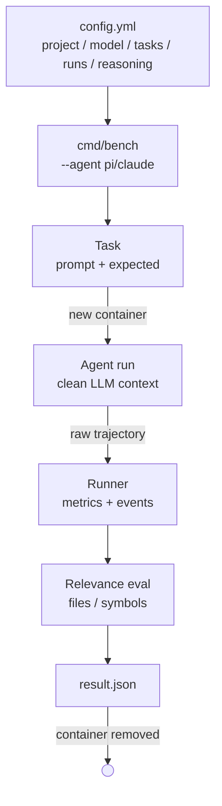
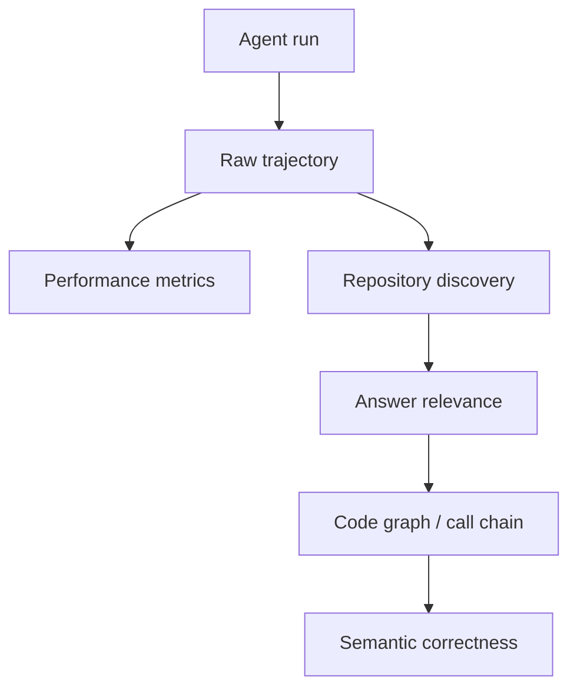

# AgentTest

> Benchmark для сравнения coding agents на задачах по исследованию исходного кода.

Сравниваются два агента — **Pi** и **Claude Code** — на одной и той же модели через OpenRouter, на реальном большом репозитории (`kubernetes/kubernetes`). Фокус бенчмарка — **repository research**: поиск нужных участков кода, восстановление call chain и объективное сравнение качества исследования.

| | |
|---|---|
| **Агенты** | Pi, Claude Code |
| **Модель** | `deepseek/deepseek-v4-flash-0731` (через OpenRouter) |
| **Target repo** | [`kubernetes/kubernetes`](https://github.com/kubernetes/kubernetes) |
| **Язык** | Go |

---

## Содержание

- [Текущее состояние проекта](#текущее-состояние-проекта)
- [Как это работает](#как-это-работает)
- [Pipeline](#pipeline)
- [Структура проекта](#структура-проекта)
- [Конфигурация](#конфигурация)
- [Задачи (Tasks)](#задачи-tasks)
- [Уровни задач](#уровни-задач)
- [Контроль галлюцинаций](#контроль-галлюцинаций)
- [Запуск](#запуск)
- [Execution model](#execution-model)
- [Конфигурация агентов](#конфигурация-агентов)
- [Результаты](#результаты)
- [Relevance evaluation](#relevance-evaluation)
- [Архитектура оценки](#архитектура-оценки)
- [Console output](#console-output)
- [Текущий scope и дальнейшее развитие](#текущий-scope-бенчмарка)

---

## Текущее состояние проекта

AgentTest уже умеет:

- ✅ запускать Pi и Claude Code в Docker;
- ✅ выполнять задачи последовательно;
- ✅ запускать каждый run в новом контейнере с чистым LLM-контекстом;
- ✅ сохранять raw trajectory агента;
- ✅ собирать execution и token metrics;
- ✅ фиксировать expected files и symbols для каждой задачи;
- ✅ выполнять deterministic relevance evaluation;
- ✅ показывать discovery-метрики в консоли;
- ✅ сохранять подробный `result.json` для каждого run.

**Следующий этап** — code graph и evaluation call chain. После этого поверх deterministic-проверок можно будет добавить semantic/LLM evaluation.

---

## Как это работает

За один запуск бенчмарка выбирается **один** агент:

```bash
go run ./cmd/bench --agent pi
# или
go run ./cmd/bench --agent claude
```

Задачи выполняются строго последовательно. Каждый run стартует в новом Docker-контейнере, при этом target repository **не копируется** в образ, а монтируется внутрь:

```
PROJECT_PATH:/workspace
```

После завершения run контейнер удаляется через `--rm`.

---

## Pipeline



---

## Структура проекта

```
AgentTest/
├── .claude-agent/
│   └── Dockerfile
├── .pi-agent/
│   └── Dockerfile
├── cmd/
│   └── bench/
│       └── main.go
├── internal/
│   ├── agent/
│   │   ├── agent.go
│   │   ├── claude.go
│   │   ├── factory.go
│   │   ├── pi.go
│   │   └── utils.go
│   ├── config/
│   │   └── config.go
│   ├── eval/
│   │   └── relevance.go
│   ├── runner/
│   │   └── runner.go
│   └── tasks/
│       ├── tasks.go
│       └── tasks.yaml
├── .env
├── .gitignore
├── config.yml
├── docker-compose.yml
├── go.mod
└── README.md
```

---

## Конфигурация

Настройки бенчмарка находятся в `config.yml`.

```yaml
benchmark:
  project_path: /home/kostapo/GolandProjects/kubernetes
  model: deepseek/deepseek-v4-flash-0731
  results_dir: results
  task_file: tasks.yaml
  runs: 1
  reasoning: off
```

### Поля конфигурации

| Поле | Описание |
|---|---|
| `project_path` | Путь к target repository |
| `model` | Модель OpenRouter |
| `results_dir` | Директория с результатами |
| `task_file` | Имя task-файла внутри `internal/tasks` |
| `runs` | Количество повторов каждой задачи |
| `reasoning` | Режим reasoning: `off` или `on` |

> **Все поля обязательны.** `runs` должен быть больше `0`. Допустимые значения `reasoning`: `off`, `on`.

### API key

OpenRouter API key хранится в `.env`:

```
OPENROUTER_API_KEY=...
```

> ⚠️ Секреты не должны попадать в git, raw logs или debug output.

---

## Задачи (Tasks)

Задачи находятся в `internal/tasks/tasks.yaml`. Task-файл одновременно является:

- набором prompt'ов для агентов;
- описанием уровня сложности;
- эталоном для deterministic evaluation.

### Meta

Task-файл содержит информацию о репозитории и коммите, относительно которого были подготовлены expected-значения:

```yaml
meta:
  repo: kubernetes/kubernetes
  commit: 400031d69530e018d5c001a922d3c5d2afaba954
```

> При смене commit **expected paths и symbols необходимо перепроверять**.

### Структура задачи

```yaml
- id: t1
  tier: 1
  prompt: "Найди определение публичного типа Pod (API v1). Укажи файл и место определения."
  expected:
    files:
      - staging/src/k8s.io/api/core/v1/types.go
    symbols:
      - Pod
```

### Expected: три категории

| Категория | Описание |
|---|---|
| `expected.files` | Обязательные файлы. Если не найден — отражается в relevance result. |
| `expected.also_ok` | Допустимые связанные файлы. Необязательны, на факт выполнения не влияют, но фиксируются отдельно — какие ещё участки repo были исследованы. |
| `expected.symbols` | Ожидаемые символы исходного кода. Для неоднозначных случаев — квалифицированные имена (`DeploymentController.syncDeployment`, `Scheduler.ScheduleOne`, `GetOptions.Run`). Простое имя (`Pod`) — только если это однозначно соответствует задаче. |

### Вспомогательные комментарии

В task-файле могут присутствовать комментарии вида:

```yaml
# chain: ...
# ждём: ...
```

Они содержат ожидаемую call chain и дополнительные признаки правильного ответа. **Сейчас в deterministic scoring не участвуют** — это материал для ручной проверки и будущего call-chain/LLM evaluation.

---

## Уровни задач

| Tier | Название | Что проверяет | Пример |
|---|---|---|---|
| **1** | Точечный поиск | Поиск конкретного файла, символа или entry point | «Найди определение публичного типа Pod (API v1)» |
| **2** | Простой trace | Связать несколько частей исходного кода, восстановить основной путь | «Как kube-apiserver сохраняет создаваемый объект в etcd?» |
| **3** | Multi-hop trace | Пройти через несколько подсистем, восстановить последовательность взаимодействий | «Проследи путь Pod от создания через kube-apiserver до момента, когда kubelet начинает его синхронизацию» |
| **4** | Архитектурное исследование | Восстановить устройство подсистемы по нескольким участкам исходников и объяснить общий паттерн | «Исследуй архитектуру Kubernetes scheduler по исходному коду» |

---

## Контроль галлюцинаций

В бенчмарке есть задачи, для которых ожидаемая реализация **отсутствует**:

```yaml
- id: t13
  tier: 1
  prompt: "Где реализована команда kubectl deploy? Найди entry point."
  expected:
    files: []
```

Такие задачи проверяют поведение агента, когда в repository нет запрошенного entry point. Важно не просто отсутствие находок, а то, что агент **не выдаёт несуществующий путь за реализацию**.

---

## Запуск

**Pi:**

```bash
go run ./cmd/bench --agent pi
```

**Claude Code:**

```bash
go run ./cmd/bench --agent claude
```

За один запуск используется только один агент. Для сравнения нужны два отдельных запуска:

```bash
go run ./cmd/bench --agent pi
go run ./cmd/bench --agent claude
```

---

## Execution model

Задачи выполняются строго последовательно:

```
task 1
  run 1
  run 2
  ...

task 2
  run 1
  run 2
  ...

task 3
  ...
```

Для каждого run:

1. Создаётся новый Docker-контейнер.
2. Target repository монтируется в `/workspace`.
3. Агент запускается с чистым LLM-контекстом.
4. Собираются `stdout` и `stderr`.
5. Raw events сохраняются в `events.jsonl`.
6. Считаются execution и token metrics.
7. Выполняется deterministic relevance evaluation.
8. Сохраняется `result.json`.
9. Контейнер удаляется через `--rm`.

> **Timeout не используется.** Run завершается после окончания процесса агента или его аварийного завершения.

---

## Конфигурация агентов

### Pi

Запускается в JSON mode:

```bash
pi \
  --mode json \
  --provider openrouter \
  --model deepseek/deepseek-v4-flash-0731 \
  --thinking off \
  -p "<TASK>"
```

Режим `thinking` определяется значением `benchmark.reasoning`:

| `reasoning` | `--thinking` |
|---|---|
| `off` | `off` |
| `on` | `max` |

### Claude Code

Запускается в structured streaming mode:

```bash
claude \
  -p "<TASK>" \
  --output-format stream-json \
  --verbose
```

Параметр thinking управляется через переменную окружения `MAX_THINKING_TOKENS`.

> Интеграция Claude Code с внешним OpenRouter provider рассматривается отдельно — поведение reasoning в этом режиме отличается от нативного режима Pi.

---

## Результаты

Каждый run получает отдельную директорию:

```
results/
└── t1-pi-001/
    ├── stdout.jsonl
    ├── stderr.log
    ├── events.jsonl
    └── result.json
```

| Файл | Содержимое |
|---|---|
| `stdout.jsonl` | Raw stdout процесса агента |
| `stderr.log` | Raw stderr процесса агента |
| `events.jsonl` | Нормализованная trajectory (по строке на событие) |
| `result.json` | Итоговый результат конкретного run |

Формат строки `events.jsonl`:

```json
{
  "t_ms": 1234,
  "agent": "pi",
  "event": {
    "type": "..."
  }
}
```

### Result metrics

**Execution metrics**
- `wall_time_ms` — полное время выполнения
- `time_to_first_tool_ms` — время до первого tool call
- `time_to_answer_ms` — время до финального ответа
- `tool_calls` — количество tool calls

**Token metrics**
- `input_tokens`
- `output_tokens`
- `reasoning_tokens`
- `cache_read_tokens`
- `cache_creation_tokens`

**Process metrics**
- `exit_code`
- `process_ok`

**Answer**
- `answer` — финальный ответ агента

**Raw data**
- `stdout_file`, `stderr_file`, `events_file`

**Relevance metrics**
- `relevant_files_found` / `relevant_files_missing`
- `also_ok_files_found`
- `relevant_symbols_found` / `relevant_symbols_missing`

> Cost в текущем бенчмарке не используется.

---

## Relevance evaluation

Реализовано в `internal/eval/relevance.go`. Это первый уровень quality evaluation — **repository discovery**.

Evaluator сопоставляет trajectory и финальный answer с `expected.files`, `expected.also_ok`, `expected.symbols`, определяя для каждого файла и символа статус `found` / `missing`.

**Пример результата:**

```json
{
  "relevant_files_found": ["pkg/kubelet/kubelet.go"],
  "relevant_files_missing": ["pkg/kubelet/config/apiserver.go"],
  "also_ok_files_found": ["pkg/scheduler/schedule_one.go"],
  "relevant_symbols_found": ["Kubelet.SyncPod"],
  "relevant_symbols_missing": ["NewSourceApiserver"]
}
```

### ⚠️ Важное ограничение

Текущий relevance evaluator **не доказывает техническую корректность ответа**. `relevant_files=1/1` означает лишь, что ожидаемый файл был обнаружен matcher'ом — это не значит, что агент:

- правильно объяснил роль файла;
- правильно восстановил call chain;
- корректно описал архитектуру;
- не сделал техническую ошибку в финальном ответе.

---

## Архитектура оценки

Evaluation разделяется на независимые уровни:

| Уровень | Название | Статус | Суть |
|---|---|---|---|
| **1** | Repository discovery | ✅ Реализовано | `expected → trajectory + answer → found/missing` |
| **2** | Answer relevance | 🔜 Планируется | Действительно ли ответ отвечает на задачу и использует найденный код по назначению (нужен smart-matching, не строковый) |
| **3** | Code graph / call-chain evaluation | 🔜 Планируется | Построение code graph (`file → package → symbol → caller → callee`) и сопоставление с expected chain: nodes found, edges found, path coverage, missing nodes, unexpected detours |
| **4** | Semantic correctness | 🔜 Планируется | Техническая корректность, правильность call chain, роли компонентов, причинно-следственные связи, полнота, фактические ошибки — через LLM judge поверх deterministic-проверок |



---

## Console output

В консоли выводится только summary:

```
=== t1-pi-001 ===
agent=pi wall=32405ms tools=21 exit=0 answer=32220ms input=7462tok output=2558tok reasoning=0tok relevant_files=1/1 relevant_symbols=1/1 process_ok=true
```

**Формат:**

```
agent=<agent>
wall=<time>
tools=<count>
exit=<code>
answer=<time>
input=<tokens>
output=<tokens>
reasoning=<tokens>
relevant_files=<found>/<total>
relevant_symbols=<found>/<total>
process_ok=<bool>
```

Такой формат позволяет быстро видеть в одной строке:

- **performance** → wall / answer / tools / tokens
- **discovery** → relevant files / symbols
- **process** → exit / process_ok

> Полный `answer` в консоль не выводится — он сохраняется в `result.json`.

### Как интерпретировать relevance

Relevance и performance — **независимые измерения**. Например:

```
agent=pi wall=19080ms tools=14 exit=0 answer=18906ms input=5325tok output=1449tok reasoning=0tok relevant_files=0/1 relevant_symbols=1/1 process_ok=true
```

означает: процесс успешно завершился, агент использовал 14 tool calls, обязательный файл **не найден**, а expected symbol найден. Другой run той же задачи может дать `relevant_files=1/1 relevant_symbols=1/1` — это уже другое поведение discovery даже при одинаковых агенте и модели.

Именно поэтому бенчмарк поддерживает **несколько runs** для одной задачи.

---

## Текущий scope бенчмарка

**Измеряется:**

- Performance — wall time, time to first tool call, time to answer, tool calls, input/output/reasoning tokens, cache read/creation tokens.
- Repository discovery — найдены ли обязательные файлы и symbols, какие also_ok файлы исследованы.
- Process — exit code, успешность процесса.

**Пока не входит в scoring:**

- качество объяснения;
- корректность call chain;
- архитектурная корректность;
- полнота ответа;
- семантическая правильность;
- `chain` / `ждём` комментарии из task-файла (пока не разбираются evaluator'ом автоматически).

### Дальнейшее развитие

```
1. Deterministic discovery        →  files / symbols
2. Repository code graph          →  symbols / callers / callees
3. Trajectory → graph mapping     →  что агент реально исследовал
4. Call-chain evaluation          →  expected chain vs observed path
5. Answer relevance               →  соответствует ли ответ задаче
6. Semantic correctness           →  LLM-based evaluation
```

> Цель — не заменить raw trajectory одним score, а сохранить несколько независимых измерений, по которым можно понять поведение агента.

---

## Current MVP principle

```
одна задача
    ↓
один чистый agent run
    ↓
один Docker container
    ↓
raw trajectory
    ↓
performance metrics
    ↓
deterministic discovery metrics
```

Дальнейшие уровни оценки строятся поверх этой базовой трассы и **не должны скрывать исходные данные**.